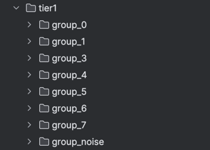
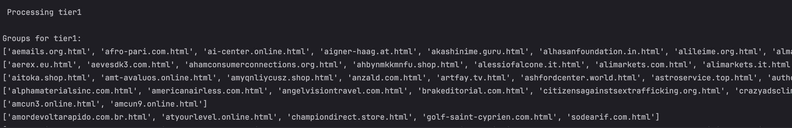

## Visual Similarity Clustering of HTML Pages

This project aims to match and group HTML-rendered websites based on visual similarity.  
Using perceptual hashing (pHash and dHash) combined with DBSCAN clustering, the system detects visually similar pages rendered from HTML files.

---

### Detailed Process

- **Render HTML files using headless Chrome**
- **Capture screenshots for each rendered page**
- **Compute perceptual image hashes (pHash and dHash)**
- **Cluster similar pages using DBSCAN and Hamming distance**

---

### Screenshot Extraction and Hashing Specifications

**Rendering and Screenshot Capture**
- HTML pages are rendered in headless Chrome to ensure uniform layout and style application.

```python
chrome_options = Options()
chrome_options.add_argument("--headless")
chrome_options.add_argument("--disable-gpu")
chrome_options.add_argument("--window-size=1920x1080")
driver = webdriver.Chrome(options=chrome_options)

driver.get("file://" + filepath)
driver.save_screenshot(screenshot_path)
```

- Each page is screenshot at a fixed resolution for consistency.

**Perceptual Feature Extraction**
- Screenshots are converted to grayscale and resized to `256x256`.
- Both `pHash` (captures global visual content) and `dHash` (captures local edge structure) are computed.
- Hash vectors are combined and stored in a NumPy array for clustering.

```python
img = Image.open(path).convert("L").resize((256, 256))
ph = imagehash.phash(img)
dh = imagehash.dhash(img)
combined = np.concatenate((ph.hash.flatten(), dh.hash.flatten()))
```

---

### Clustering with DBSCAN

- **Algorithm:** DBSCAN (Density-Based Spatial Clustering of Applications with Noise)
- **Distance Metric:** Hamming distance over binary hash vectors
- **Parameters:** `eps = 0.25`, `min_samples = 2`

```python
clustering = DBSCAN(eps=0.25, min_samples=2, metric='hamming')
labels = clustering.fit_predict(hashes)
```

- Files are grouped into clusters based on label:

```python
groups = {}
for label, filename in zip(labels, filenames):
    groups.setdefault(label, []).append(filename)
```

---

### Final Results

The system produces clusters of HTML files whose rendered versions appear visually similar.  
For each cluster, a dedicated folder is created containing the corresponding screenshots.

Visual result:





### Story behind the code
- How did I understand the request?  
First, I read the request 2–3 times and I understood that the user wants to group similar HTML files based on their visual similarity.  
What does visual similarity mean for an actual human?  
Good thing I am a human, and for me it means that if the color scheme and the text placement are similar, then two websites are similar (e.g., WhatsApp and Telegram are similar to me).

- How can I make my laptop understand this?  
Searching web...  
...2 hours later...  
I found out that I can use perceptual hashing to get a hash of the image, and then I can use DBSCAN to group similar images based on their hash.  
What is DBSCAN? What is perceptual hashing?  
DBSCAN is a clustering algorithm that groups together points that are close to each other based on a distance metric. It is particularly useful for identifying clusters of varying shapes and sizes in large datasets.  
Perceptual hashing is a technique that generates a hash value for an image based on its visual content. It captures the essence of the image while being robust to minor changes, such as resizing or compression.

- How can I use perceptual hashing to get a hash of the image?  
I can use the `imagehash` library to compute the perceptual hash of an image. The library provides `pHash` and `dHash`, which can be used to generate a hash value for the image.

- How can I use DBSCAN to group similar images based on their hash?  
`sklearn` library to implement DBSCAN. (Happy face — I have used it before so I don’t need to go that deep into the documentation.)  
Hamming distance metric??? Ohh, ok — compute the distance between the hash values of the images. The Hamming distance is a measure of the difference between two strings of equal length (I had to Google this now because I forgot it).

- I got bored of the documentation and I started to write the code. (I had no idea what I was doing, but Selenium is not that hard.)

- After the first 3 hours I had this:
```python
chrome_options = Options()
chrome_options.add_argument("--headless")
chrome_options.add_argument("--disable-gpu")
chrome_options.add_argument("--no-sandbox")
chrome_options.add_argument("--window-size=1920x1080")  
driver = webdriver.Chrome(options=chrome_options)
```
(What to do from here...)

- Here entered the magic of copy-paste and Stack Overflow.
- Code was ready to go(it worked it grouped the pages well ) problem? ofc selenium took ages to take the sceenshots.(i think i need some optimization here)
- Solution ?? multithreading.(i had to limit the instances of chrome in order for my house to not burn down)
- other problems? of corse but this story is long and i am bored of writing it.

- After a weekend, I am here and I hope I did a good job.  
- (If not, I hope I made someone smile with this story.)
- (I committed the code to GitHub and i forgot about the .idea folder)

